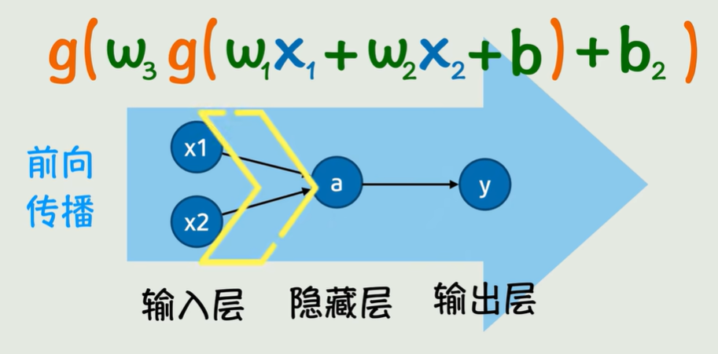

-- 本节旨在理解从函数到神经网络的过渡，理解什么是神经网络和神经网络的本质。

## 函数

​	模型的本质是一个复杂的函数，函数有输入和输出，有显式的表达式，比如F = ma，根据质量和加速度就可以输出力；类似地，大语言模型也是这样，训练好的模型，你输入一句话，他就会输出一段话。因此，大模型本质也是有函数组成的，你也可以叫做数学公式组成的。

## 神经网络

​	**符号主义**试图为每一个世界上的规律和知识寻找一个具有表达式的函数，但是这显然不太现实，因为现实中，我们可以观测到数据，比如每一年具体一个月份的房价信息，温度等等，这些数据受现实中各个因素的影响，而且这些影响都是不确定的，无法通过具体表达式衡量的。

​	所以我们基于现实中的数据是无法找到一个确切的函数来描述输入和输出之间的关系的，就像你无法为房价的波动找到一个具有具体表达式的函数一样，符号主义显然就行不通了。

​	那么就出现了**联结主义**，索性不找一个具体函数了，而是基于现有的数据，找到一个裸模型，如一次函数，然后根据现有的数据算出a和b，使得这个算出来的一次函数更贴合这些数据，我们称之为**<u>拟合</u>**。

如下图：

​	但是世界上的数据千差万别，不可能都人为选择模型，而且这个裸模型必然不能太简单。所以就有了神经网络。神经网络的本质是一个线性函数外面嵌套一层激活函数，就像下图这样：

​	如果有多个输入即第一层是多个节点（神经元）对应第二层的一个节点（神经元），那么神经网络可以写为如下的形式，其中w~1~，w~2~，b，都是要基于数据训练得到的参数。

​	内部是线性函数，外部是激活函数，这样一层处理之后，其实就是神经网络相邻两层的关系。常见的**激活函数**有很多，它们是经过实践验证具有很好的效果的**函数簇**。

​	如果这一层神经网络还不够，那就多套几层-套一层线性变换-再套一层激活函数，理论上可以无限套娃下去；每套一层线性变化+ 激活函数，神经网络就多一层，下图是函数就是一个输入层两个神经元，第二层一个神经元，输出层一个神经元的神经网络。理论上，无限套娃下去可以逼近任意的连续函数。

​	对应的逻辑神经网络就是下面这样，每套一层线性变换+激活函数（我称之为**<u>一层处理</u>**），就相当于神经元再水平方向上又扩展了一层节点。所以，**一层处理就对应“一列有向边”**。节点（神经元）是状态，边是函数。

​	可以看到，整体由一个输入层，一个输出层，若干中间节点构成的隐藏层共同构成了神经网络，本质上还是一个函数。

​	如果更复杂了，有多个y，那就需要有多个函数，多个函数可能在形式上是一样的，那就可以写成矩阵的形式。

## 前向传播

​	有输入经过带入函数逐层计算的过程，值就像神经冲动在突触之间传递一般，这个过程就叫做前向传播。实际上就是一点一点按照步骤，从内往外把一个函数的值算出来而已。

## 结构

​	理论上，神经网络的隐藏层的层数可以无限增加-即无线套线性+激活函数；每一层的神经元的个数也可无限增加。很显然，这并不是一个函数能表示的。因为有三个输出，所以需要三个函数表达式。

​	至于多个隐藏层之间连接到同一个另外一层的隐藏层，则是隐藏层表达式作为一个自变量，再经过线性函数+激活函数得到的。也可写在一个式子当中。

​	整体的神经网络由几个式子构成，要看最后的输出有多少个。

## 训练

​	不管怎么说，我们的目的很简单，就是基于现有的数据，猜出来这些参数是多少，对于一个函数而言，输入可能是一组x构成的向量，而不简单的是一个数或者一个二维的点，可能是一个高维向量作为输入，以二维输入为例，对应一个输出是必然的。

​	但是显然猜就不行了，因为函数实在是太复杂了；而且要注意一点：要摒弃之前的“有几个未知数，就需要几个数据”，我们这里是“拟合”，显然更多高质量的数据，对我们模型的训练是更有帮助的。显然我们的关注点就转向了如何根据已有数据求这些参数的问题。

​	简单的直线拟合-线性回归非常容易得到a和b的表达式，带入数据就可以快速算出来这些数是什么。但是如果更复杂了呢？要怎么计算呢？

​	