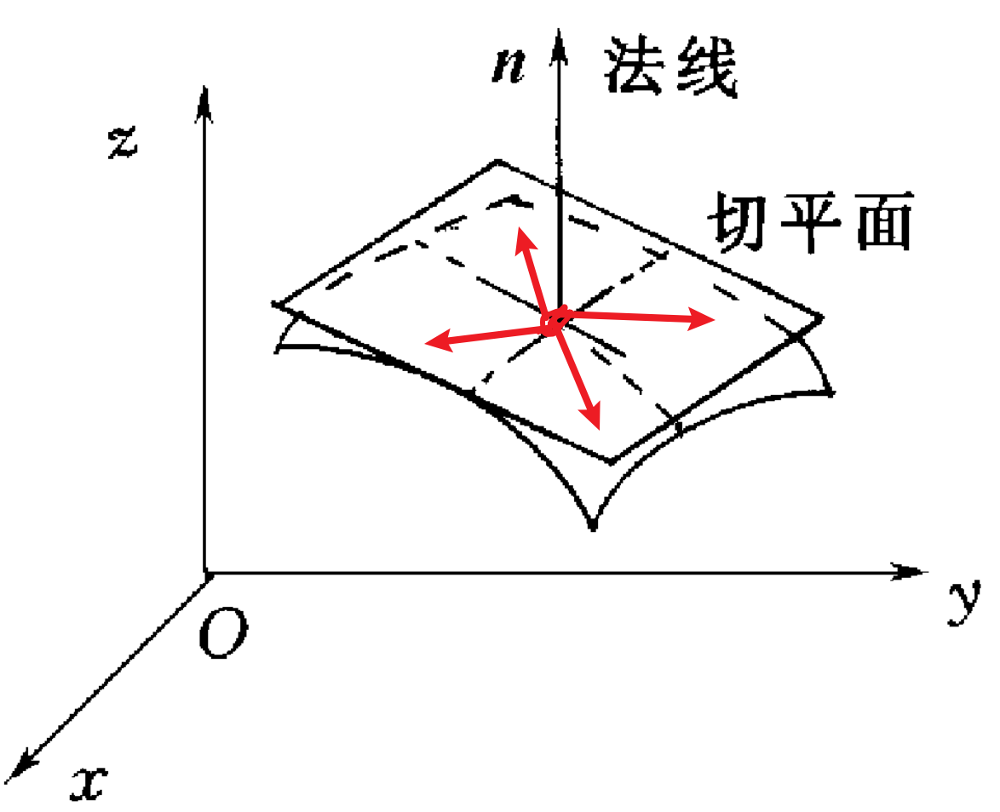

-- 本节旨在介绍训练模型/神经网络的基本原理。

## 复习：方向导数和梯度

①对于一个二元函数z = f(x,y)，在三维空间中是一个曲面。假设控制其中一个维度为常数值，如控制y不变，就相当于用一个垂直于y轴的平面△切割f(x,y)这个曲面，曲面和平面△相交得到一条曲线，那么就可以求z关于x的偏导数；类似地，我们也可以理解z对y的偏导数的概念。

②理解方向导数和偏导数的关系

​	对于曲面上的一个点(x~0~,y~0~,z~0~),其位置取决于(x~0~,y~0~),这个点确定下来，那么z对x和对y的偏导数就都确定下来了；但实际上，设想你站在一个山上的某一个点，你沿着不同方向爬山的费力程度是不一样的；再想你骑电动车过减速带，斜着过减速带带来的颠簸和垂直减速带带来的颠簸是不一样的。

​	很显然，沿着这两个不同方向，在行走相同的路程时，你上升的高度是不一样的，因为就上图而言，右侧方向的偏导数是0-它对于上坡没有任何贡献-即对于z的增大没有贡献。为了降低颠簸，我们就要尽量多沿着对z上升没有贡献的方向走。

​	实际上在图中的点处，哪怕它是一个曲面，对于一个确定的点，偏导数是确定的。那为什么朝着不同的方向前进，对z的贡献不一样呢？

​	我们用方向导数来描述在曲面上的某一点，朝着这个方向前进一个x，一个y的单位距离z的变化量-尽管它是瞬时的，是随着位置而变化的。但是理解方向导数公式的核心是：方向导数是z的变化量，就像一元函数那样，x单位变化产生的y的变化△y。

​	所以曲面上某一点的方向导数的求法就是：假设曲面上我朝着不同的方向走用射线L标识，L = （cosα，cosβ），其中α和β互余，为射线和x轴和y轴的夹角，也叫做方向角。**<u>要摒弃一种“把不同方向想象为该点在曲面上的切面的不同方向”的成见，</u>**如图1所示：

​	不要这么想。而是把方向的概念想象成二维水平面上的不同方向，和z没有任何关系。如下图过A点的几个方向所示：

​	然后要理解朝着不同方向前进，z的变化快慢不同-原因是方向导数不同。上文说过，对于曲面上一点确定，偏导数就确定了。即x和y都对z的增长分别有贡献-通过减速带的理解可以很好理解，当固定y时，如果z对x的偏导数>0,那么朝着x方向前进，z一定是变大的。类似地，当固定x时，如果z对y的偏导数>0，则朝着y的方向前进，z一定是变大的。所以**<u>方向导数是由x对z的贡献和y对z的贡献共同作用的，且独立发挥作用，所以加起来就好了</u>**。

​	既然曲面上某点偏导数确定，但是不同方向的方向导数不同，必然和这一点的方向有关系了，假设在（x~0~，y~0~）处，z对x的偏导数和对y的偏导数构成向量v，v的每一个分量都是所能贡献的最大值。沿着这个方向前进，确保了在x方向和在y方向都竭尽所能地为z的变化做贡献。沿着其他方向，方向导数并不能达到最大值，因为那样的话，就无法使得z对x的偏导数发挥最大作用-它需要乘以cosα，即需要折损。类似地，y方向同理。

​	从数学上，方向导数可以如下计算,就不难理解了；单纯考虑z对x的偏导数或z对y的偏导数也只是其中一个cos = 0的情况。实际上需要二者共同做贡献（+），而且需要两个偏导数各自乘以一个cos，相当于往各自的轴投影并发挥作用。

③理解梯度

​	那么沿着什么方向走，可以确保方向导数达到最大值呢？数量积是一个数，方向导数的计算式可以写成两个向量的数量积的形式，即

​	由几何意义可以知道，两个向量同方向即可，即射线L的方向需要和向量

​	保持一致。这个向量叫做梯度；梯度是一个向量；它的方向代表在曲面上某一个点处沿着此方向让z**<u>增长最快</u>**的方向；此处的方向导数一定是大于0的，因为沿着这个方向走，z一定是变大的，而且变大的最快。解释：此时计算方向导数的两个向量是同方向的，把梯度单位化，可以提出一个正数，然后相当于同一个向量平方，一定也是正数。如下图：

④总结

​	自此，我们理解了方向导数和梯度的概念。

* 方向导数的曲面上某一点沿着XOY平面不同方向前进的z的变化率，可正可负。
* 方向导数的定义式是：偏z/偏x * cosα + 偏z/偏y * cosβ = **（偏z/偏x，偏z/偏y ）· （cosα， cosβ）**；
* **<u>当方向为梯度方向时，方向导数最大，即是z增长最快的方向。反之，梯度的反方向是z下降最快的方向</u>**。
* 要正确理解方向的概念。

## 基础：线性回归求解w和b

​	还是以曲线拟合的最小二乘法为例，推导出a和b的公式的依据是：按照这个公式算出来的参数能够让直线和贴合真是的数据，拟合的效果最好。

​	衡量拟合的效果是用残差来分析的，残差e = 观测值 - 真实值，真实值我们是知道的，观测值是同一个x，带入到最终拟合的直线得到的y。二者作差取绝对值，然后所有的点的残差绝对值加起来，就可以衡量拟合效果了。但是带着绝对值不方便算，我们取平方再求和，即用残差的平方和来衡量直线拟合的效果。但是数据量每次不总是一样的，所以我们还需要求平均值，这就是均方误差-MSE。

​	均方误差里面的未知数是y~i~,而y~i~里面的未知数的参数w和b；所以整体损失函数L是w和b的函数。我们训练的目的是让损失函数最小，即求一下L的极值，就需要用到多元函数求极值的方法【因为曲面的极值点的切面就是水平的，就是偏导数都为0】-**偏导数为0构成的方程组联立**就可以解出来w和b的值了；如果不带入具体的（x~i~,y~i~），就可以得到w和b的公式。

## 梯度下降

1.引言

​	在神经网络这个复杂的数学函数中，想要求出很多个参数，并不能像前面那样求偏导数=0的方法。我们希望损失函数能够尽量的小，而且要尽快的小，对于输出y而言，它内部可能有很多个参数，即套了很多层，而且中间隐藏层的神经元还会线性组合+激活函数这样嵌套。**<u>每一个参数的变化都会影响y的值，进而影响损失函数L的值（损失函数的定义中是有y的，因为我们需要计算观测值，观测值y里面带着参数），我们求参数的目标就是调整参数的值，让损失函数L最小</u>**，那么参数出来了，y的表达式也就出来了。

​	我们希望试着改变一点参数的值，观测一下在这组输入（x~0~, x~1~, x~2~,....x~n~）确定的情况下，L减少的量是多少？每一次尝试改变参数的值，就叫做一次迭代。我们希望经过若干次迭代，让损失函数的值足够小，而且这个过程要尽快。

​	对于神经网络来说，每两层之间都有参数的存在。面向某一个参数进行调整【迭代】，如w~0~，我们想让w~0~的每一次调整都对L的下降产生较大的下降，即要求L对w~0~的偏导数发挥最大的影响。

​	我们希望w~0~和b和其它若干参数都往让L下降最快的方向去变，很显然只需要往梯度的反方向变化即可。如下图所示，w和b都需要若干次调整和迭代。都是基于上一次的w和b，往梯度的反方向变化，即对于每一个参数来说，是原参数的值减去偏导数的值。如下图所示：

​	具体变化的快慢的不一样的，所以需要在偏导数之前加上系数加以控制。如下图所示。通过不断调整w和b，让L朝着不断减小的过程，进而求出新的w和b，一直到损失函数足够小，这个过程就叫做梯度下降。具体的迭代式就如下图所示。

2.偏导数怎么求

​	对于线性回归而言，L(w，b）的偏导数是容易求的，直接求偏导数即可。对于神经网络而言，需要求L对某一个参数的偏导数，看下面的例子，以w~1~为例，要想求L对w~1~的偏导数，只需要用复合函数求导法则即可。先求L对观测值的导数，然后求观测值对隐藏层的偏导数，然后求隐藏层对参数的偏导数，所以最后求出来就是一个**<u>关于参数的表达式-这就是损失函数对参数的偏导数。</u>**对于一个迭代过程的参数是已知的，那么这个偏导数也就知道了。对于一组迭代过程中的参数组来说，那么梯度也就知道了，自然梯度的反向也就知道了。那么自然就知道下一次应该如何改变参数的值了。

3.神经网络的反向传播

​	神经网络的每两层之间都具有一个函数关系，或者是加了一层嵌套处理，神经网络右侧的复合函数求导，在神经网络左侧的参数计算的时候都会用到，所以我们无需重复计算，就比如我计算L对w~1~的时候用到了L对y hat的偏导数，在计算L对b~1~的偏导数时同样会用到。所以只需要计算一次L对y hat的偏导数，然后后面就可以重复利用了。

​	这样从右侧往左侧依次计算偏导数的过程，形象的理解为反向传播，反向传播算法本质上就是通过链式求导法则，从外侧往内侧逐步求导然后乘起来得到损失函数对参数的偏导数，进而得到梯度。

4.神经网络的训练

​	通过前向传播，我们可以根据输入x计算出逐层的神经元的值；并最后计算出了损失函数中的观测值（带着参数）（真实值是已知的）；得到损失函数关于参数的函数。

​	再通过反向传播，逐层计算各中间层之间的偏导数关系（中间某层的一个箭头就代表一个复合函数的某一层嵌套处理，对应着复合函数求导的一个因子）。得到损失函数L关于所有参数的偏导数，再让损失函数朝着梯度方向的反方向调整一下各个参数的值（有多少个参数，就有多少个维度）。

​	这就构成了神经网络的一次训练，即一次迭代。

​	神经网络的训练就是这样一步一步迭代下去的，一直到我们满意的损失函数值（足够小）为止。

## 巩固知识-学习率

​	可以看一下这个视频： https://b23.tv/Q0bWuJs，具体通过一个实例理解神经网络的参数是如何训练的，这个视频加深了我对梯度下降中学习率的存在意义的理解。

​	因为偏导数确实只对很小的一个范围有效，所以必然不可能让参数变化单位1，而是所以需要加参数来控制，学习率η通常取很小（如0.00001），来最大限度运用这一点的偏导数的意义。

