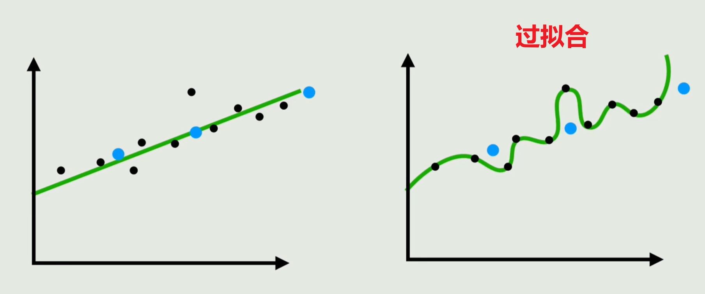
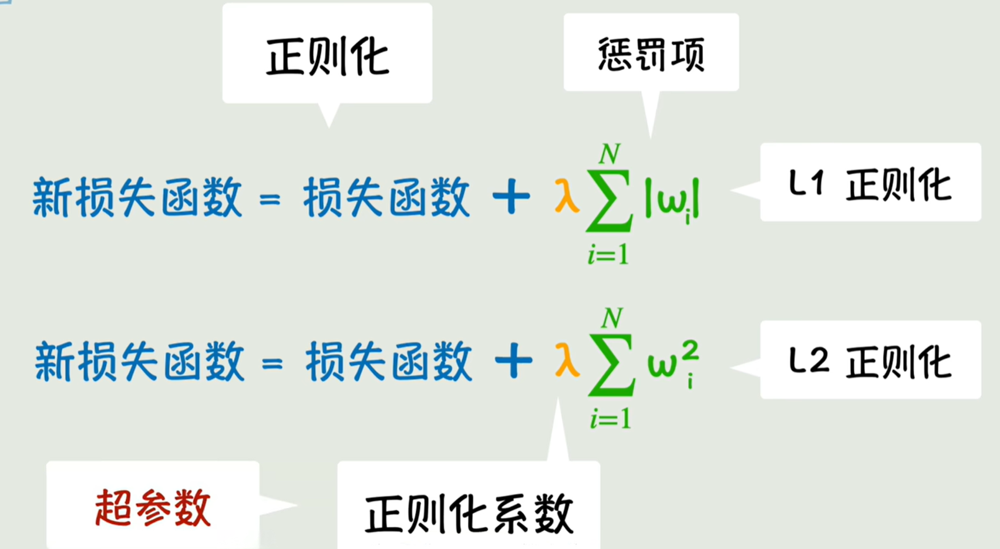

-- 本节旨在介绍训练模型/神经网络的过程中出现的最经典的问题-过拟合问题以及常见对策。

## 过拟合

①过拟合是什么

​	神经网络的训练旨在让损失函数足够小，但是不能太小，否则对于训练数据就过于完美，但是可能对于没见过的数据的计算可能偏离真实的数据，如下图所示，就称这种在训练数据上表现很完美的，但是在预测数据上表现较差的现象称为过拟合，有点类似于教条主义了。

​	在没见过的数据上的表现能力称之为泛化能力，我们希望我们的模型具有较强的泛化能力。那么如果寻找这个中庸的程度呢？既不能损失函数过于小，也不能太大。

②为什么会出现过拟合？  

①【模型问题】模型过于复杂 - 选择简单模型

​	对于一个模型而言，让损失函数足够小其实并没有问题。但是如果我们选择的模型不合适，如层数太多，肯定是不利于泛化能力的提高的。导致模型把噪声也学会了。

​	选择的模型的层数太多了，曲线太灵活。本来选择线性模型就可以了，但是我们选择了嵌套了很多层的模型，就导致过拟合。

​	所以**<u>神经网络并不是越复杂越好</u>**，有时候简单的模型可能会起到很好的效果。

②【数据问题】数据不够 - 增加训练的数据量 - 数据增强

​	但是数据是十分有限的，我们有时候无法收集到或者懒得收集那么多数据，那怎么办呢？那就在原有的数据上生产更多的数据。

​	以CV领域为例，**<u>数据增强</u>**是指在原有的数据上，给数据旋转、翻转、加噪声等手段创造更多的训练数据。数据增强的好处是①增大了数据量 ； ②增强了模型的鲁棒性，不会因为模型因为一点点数据波动就产生较大的输出变化值。

③【训练问题】

1）**<u>提前终止训练</u>**。可以阻止参数朝着过拟合的方向发展。对于一个模型来说，损失函数值足够小可能会导致把噪声也学会，导致过拟合。所以只要提前终止训练，让损失函数值不那么小就可以了。

2）**<u>正则化</u>**。参数训练的过程是梯度下降，即通过调整参数的值，让L以尽快的速度下降的方法，那如果参数调整的很夸张，即调整幅度很大，但是对L的下降已经没有明显效果了，很显然这是不合适的调整。我们要抑制这种调整的过程，就要使用正则化方法。

​	正则化指的是给损失函数添加一个**参数惩罚项**（是参数的函数），常见的惩罚项有参数绝对值之和、参数平方和等等，分别对应了**L1正则化**和**L2正则化**，因为绝对值之和是L1范式，平方和是L2范式，如下图所示：

​	这样当w变化的时候，惩罚项也会变大，会抑制L的减小。只有当w变化一点，损失函数的变化足够大以至于“盖过”惩罚项的增大时，新的损失函数才会减小。那么此时训练才是有效的的。给惩罚项添加一个控制惩罚力度的参数λ，这个控制参数的参数，即正则化系数就叫超参数。

3）dropout法【丢弃法】

​	为了防止模型过拟合，即过度依赖于某几个参数-某几个参数发挥的影响过大。可以在训练过程中随机丢弃几个参数，让模型必须学会依赖于大部分参数。

## 其它问题

​	训练过程中会出现其他问题，不只是过拟合这一个问题。

* 如**<u>梯度消失</u>**问题：因神经网络深度太高导致了参数反向传播时越来越小，导致参数的更新困难。
* **<u>梯度爆炸</u>**：梯度数值越来越大，导致参数的调整幅度过程无法控制。
* <u>**收敛速度过慢**</u>：如陷入局部最优或来回震荡。
* **<u>计算开销过大</u>**：数据规模太大导致计算太耗时。

​       每个问题人们都想了很多对策，如梯度裁剪、残差网络、权重初始化、归一化、动量法、RMSProp、Adam、mini-batch等。

​	后面我们会讲解CV领域的卷积神经网络CNN和NLP领域的循环神经网络RNN，以及后来的Attention机制以及由此催生出来的Transformer模型，奠定了现在的LLM基础。

