-- 本节讲解大概的CNN结构和基本原理，不深入，属于入门型。

1.从多输出的统一形式函数到矩阵运算

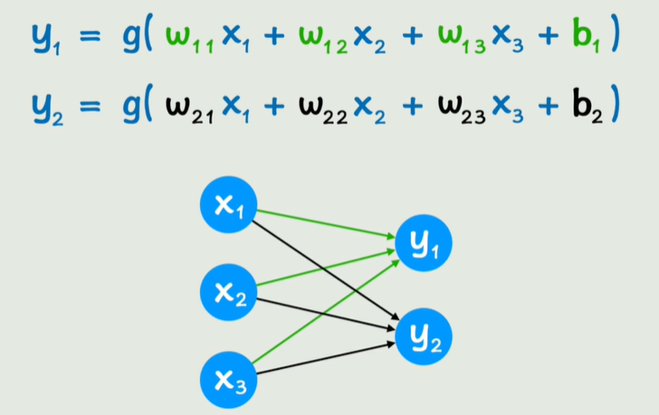

​	如果有多个输出y，而且它们在形式上又是一样的，我们就可以把这种y写成矩阵运算的形式，如下图所示，这样让形式更简洁，矩阵运算也更方便GPU并行运算。

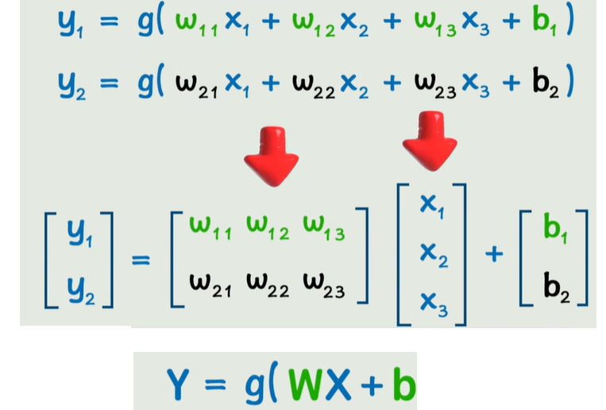

​	由于神经网络的多层之间都是这种线性运算+激活函数这样的嵌套，所以就可以写成统一的形式，为了体现出层和层之间和关系，以及体现X和Y在第几层，加上上标即可。如下图所示，L是layer的意思，A^[0]^是输入层，中间的A是隐藏层，而最后的A是输出层。W^[L]^和b^[L]^就是中间若干层之间的参数.

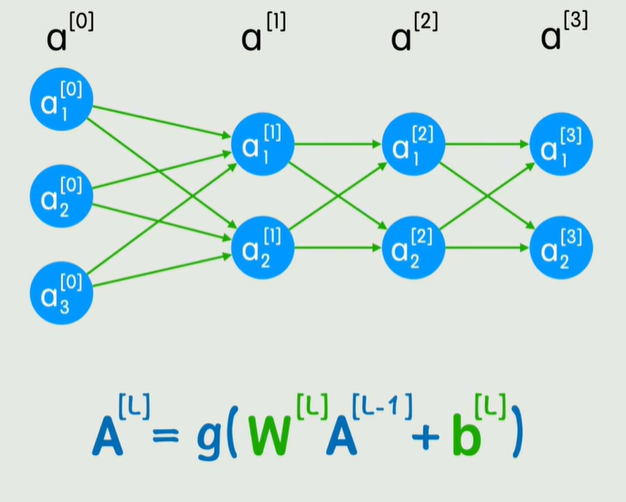

2.全连接层【FC-full connection】

​	假设某一层神经元的每一个神经元，都和上一层的所有神经元相连，则称该层是**<u>全连接层</u>**。全连接层是神经网络结构中的一种结构之一。它的缺点很明显，就是会产生大量的参数。你可以近似认为每增加一个边，就需要增加一个w~i~参数；两层之间如果后一层是全连接层，假设前一层有m个神经元，全连接层有n个神经元，那么至少会涉及到mn个参数（因为我们忽略了b的存在，所以说“至少”）。

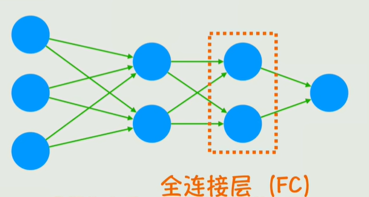

3.从全连接到卷积运算

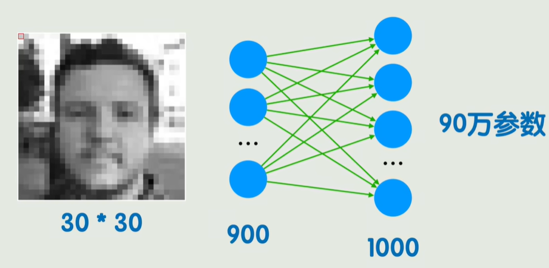

​	我们提到，全连接的缺点是涉及到的参数太大，如图涉及到至少90w个参数。而且把900个像素对应的灰度值作为输入也只是相当于把像素按顺序罗列在一起，并没有存储到像素之间的关系。加入人物仅仅是略微发生变化，那么就要重新进行大量的重复计算了。

​	为了降低参数量并存储像素之间的关系。我们引入了卷积的概念。

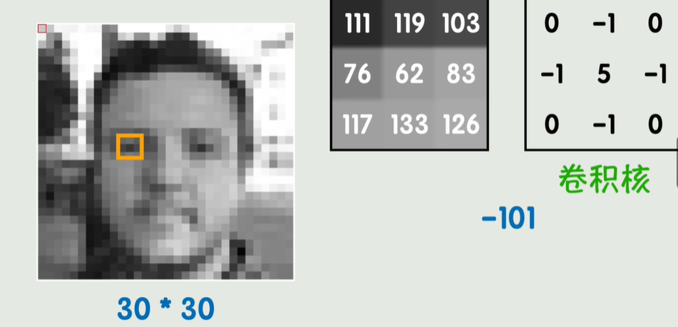

​	图片是由一个一个像素构成的，像素是图像的基本单位。上图这样的黑白图又叫做灰度图，是单通道【1 channel】图像。即用一个数就可以表示这个像素的颜色了，这个数表示从白色到黑色的不同程度，取值范围是【0,255】，值越大，越接近黑色。

​	我们把一个3 * 3的矩阵称之为卷积核，当然也有 5 * 5的卷积核，最常见的还是3 * 3的卷积核，这个卷积核是经过训练得到的一个矩阵。除了图片的边界处，我们遍历每一个像素点，以它为核心取3 * 3的区域矩阵，矩阵的每一个位置都对应了图片对应像素的灰度。卷积运算指的是：**<u>遍历每一个像素【非边界】，让以该像素为核心的3 * 3灰度矩阵和卷积核的对应位置分别相乘再求和得到新的值作为新图像的那个像素位置的灰度，最终得到新的图片的过程。</u>**上图的运算过程就是遍历每一个非边界像素点，每一次都是九次乘法和一次加法得到新数，然后成为新图片那个像素点的灰度值。

​	通过卷积，可以完成一些常规的PS操作，如模糊、锐化、浮雕等效果，都是通过不同的卷积核进行卷积运算实现的。

实践：通过传统的卷积运算，实现图片的锐化

效果图：

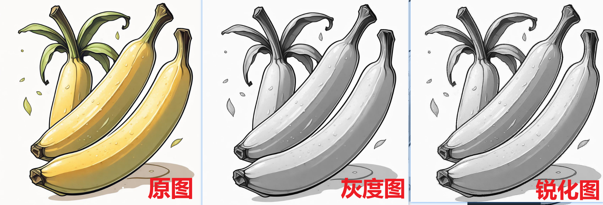

核心代码介绍：

```python
from PIL import Image
from scipy import ndimage

img = Image.open(image_path) # open方法打开图片
img = img.convert('L') # convert方法，传入L，转化为灰度图
img.save(r'D:\cv_data\banana3.jpeg') # save方法保存到指定路径

def create_sharpen_kernel(intensity=1.0):
    """创建锐化卷积核，intensity参数可调整锐化强度"""
    # 基础拉普拉斯算子
    base_kernel = np.array([
        [0, -1, 0],
        [-1, 4, -1],
        [0, -1, 0]
    ])
    # 单位矩阵（保持原图）
    identity = np.array([
        [0, 0, 0],
        [0, 1, 0],
        [0, 0, 0]
    ])
    # 通过线性组合调整锐化强度
    return identity + intensity * base_kernel

# 应用卷积
    sharpened_image = ndimage.convolve(image, kernel)
```

​	其中ndimage的convolve方法可以实现灰度图的锐化，只需要传入锐化所需要的卷积核即可。

4.卷积层

​	CNN中的卷积核是未知的，即需要经过训练算出来的参数矩阵。如下图所示，卷积层就是卷积核。这样就可以大大减少参数量，现在只需要让若干个输入（如九个像素代表的灰度值）和卷积核做卷积运算就可以得到输出了。可以看到，卷积层的参数量就只是卷积核本身。

​	但是神经网络层和层之间的运算形式仍然保持不变，只是由矩阵乘法变为了卷积运算而已。仍然需要加上b向量再套一层激活函数。

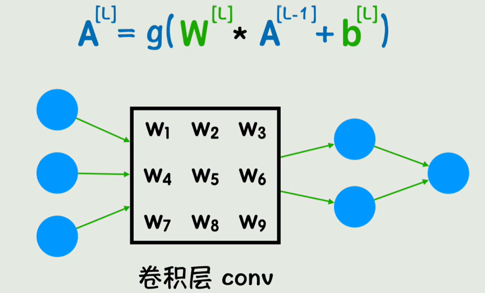

​	神经网络就可以抽象为这种形式：

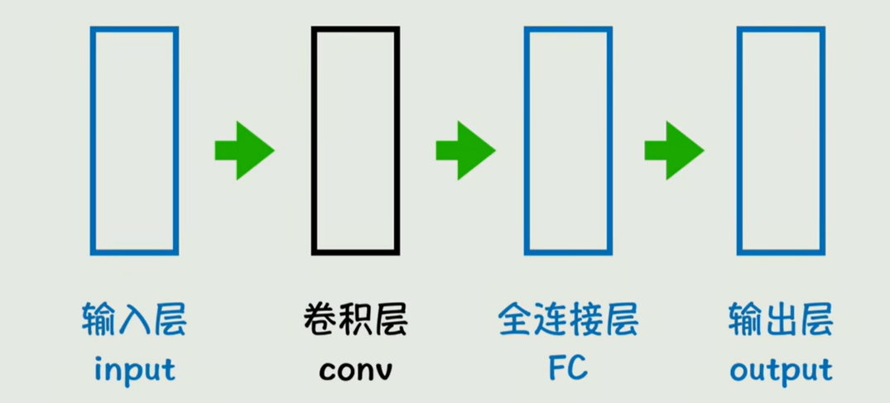

5.CNN

​	CNN，即卷积神经网络中除了输入输出，全连接层，卷积层，还有池化层，用于把卷积之后的特征图像进行降维，减少计算，同时保留主要特征。如下图所示：

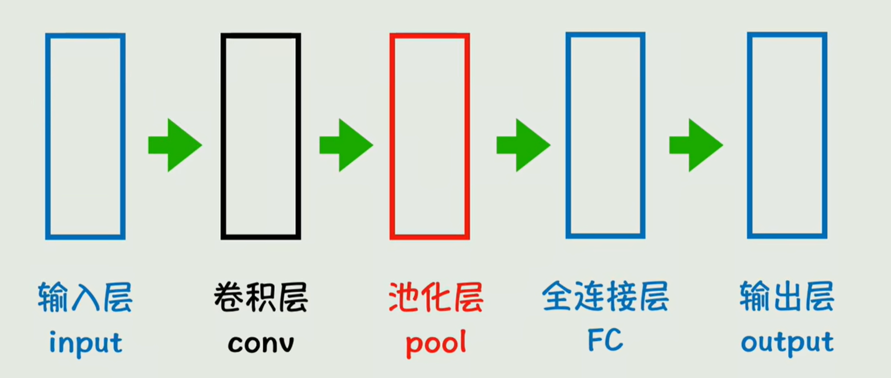

​	CNN中的卷积层，池化层，全连接层都可以有若干个。即CNN的基本结构就是输入，输出，中间若干卷积层 + 池化层，然后若干全连接层。

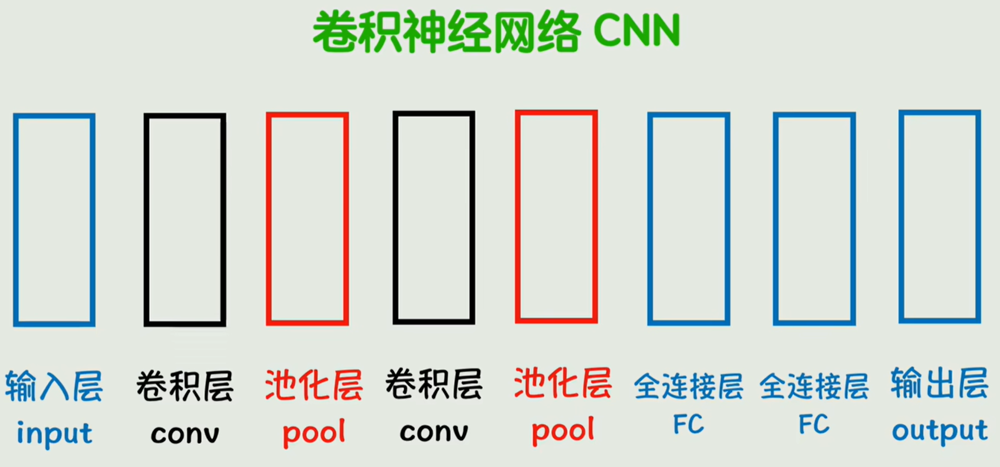

​	使用CNN的好处是方便中间隐藏层的可视化，每一层中间干了什么事是可以可视化出来的。

